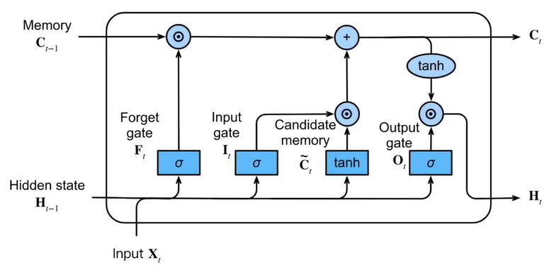
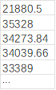
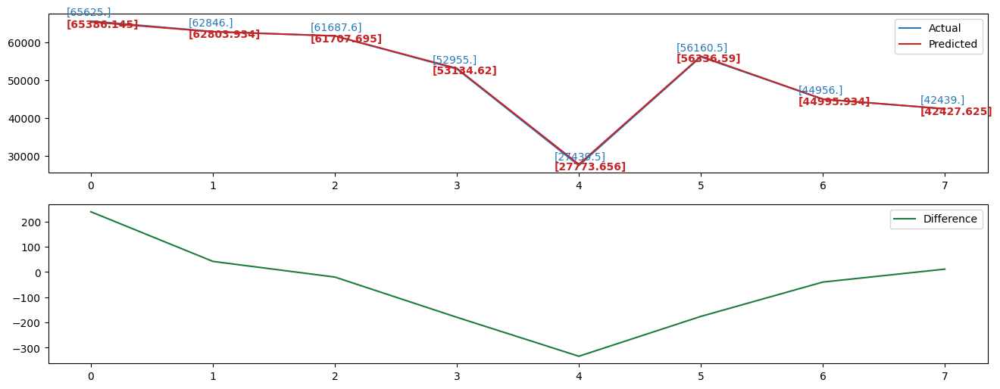
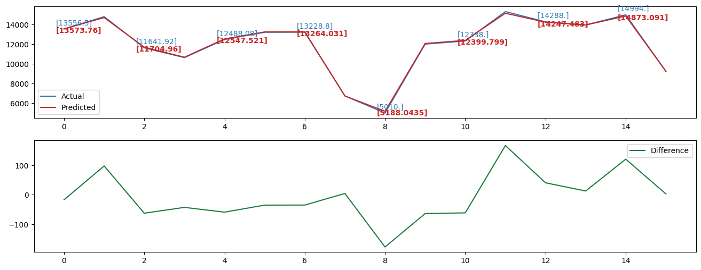

# Time-series-prediction-based-on-LSTM-model

*图片来自于《动手学深度学习》

*Image comes from the book "Dive into Deep Learning"

## 简述 Brief Introduction
LSTM模型在时间序列模型上的简单应用，代码参考来自 https://zhuanlan.zhihu.com/p/104475016.

A simple application on inventory time series data prediction of LSTM model，the code refer to https://zhuanlan.zhihu.com/p/104475016.

## 数据格式示例 Data Styles Examples
本次预测模型所代码里所用数据样式均为纯数字如下
The data styles used in the code of this prediction model are pure numbers as follows:

## 预测结果示例 Prediction Results Examples

